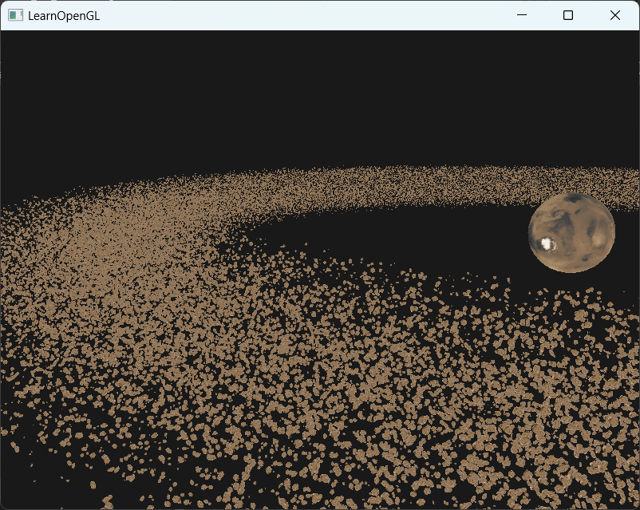
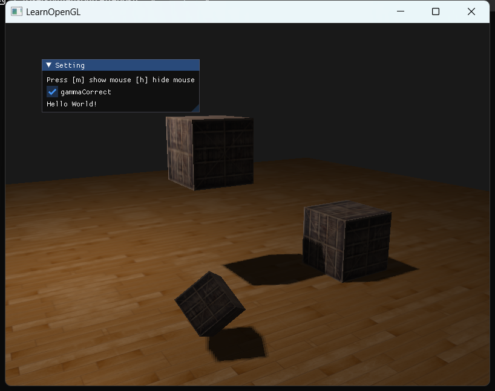
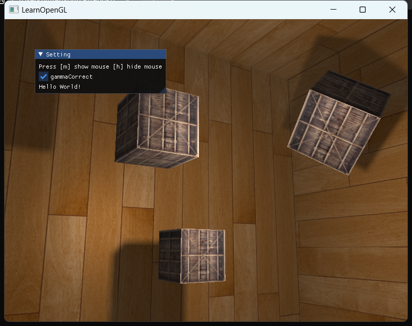
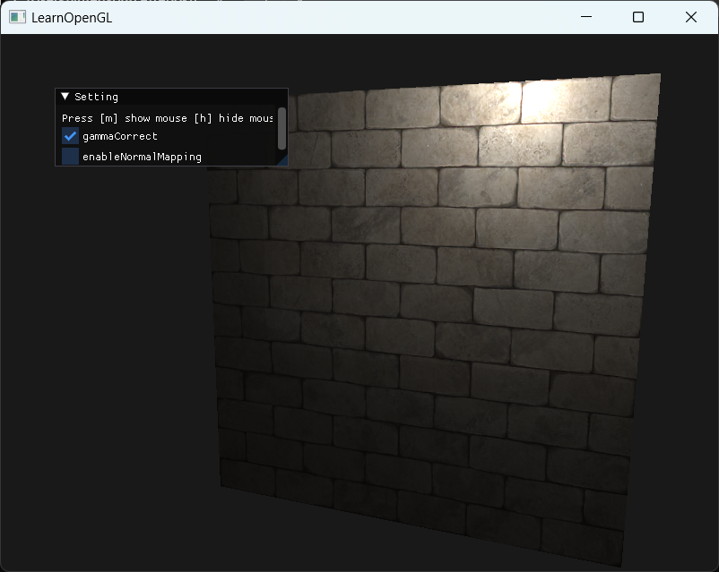
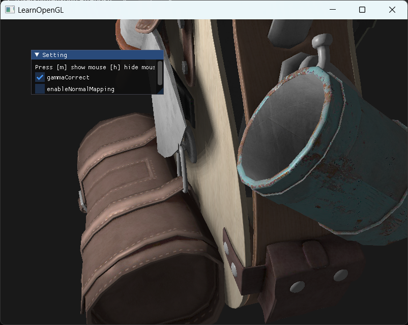
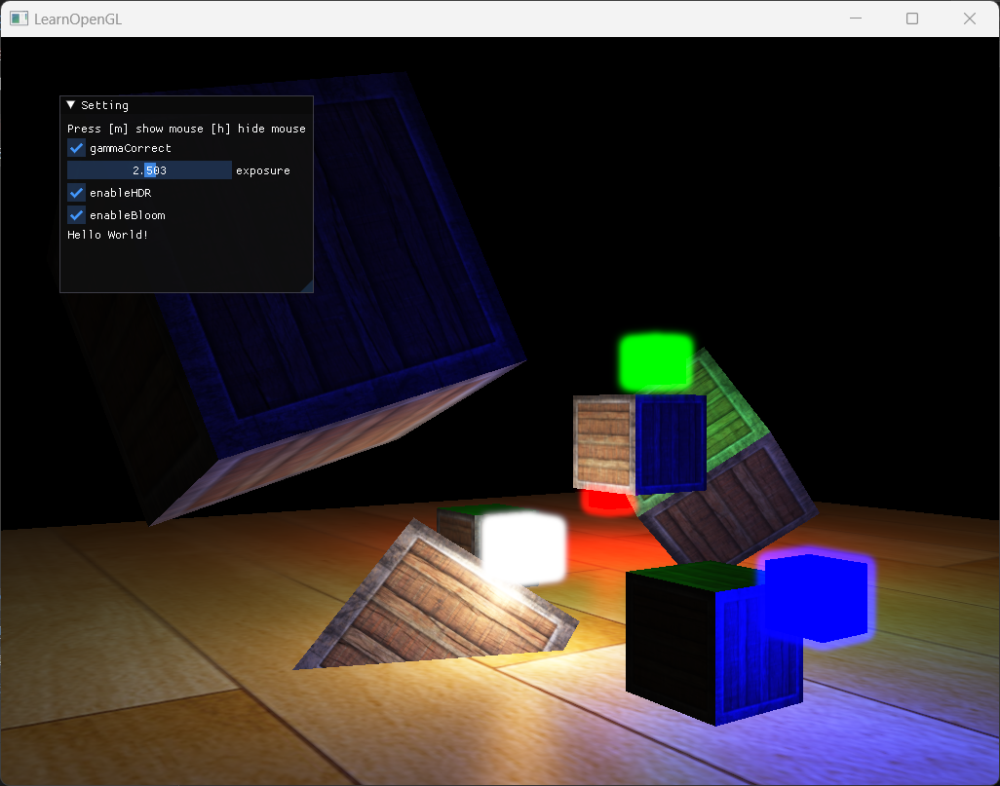

# learnOpenGL

A great tutorial for openGL and Computer Graphics!
<https://learnopengl.com/>
This repository is used to record my way to completing this tutorial.

CG is cool!

## Some Awsone Demo 
### 4.10 Instancing

### 5.3.1 Shadow Mapping

### 5.3.2 Point Shadows

### 5.4 Normal Mapping

NormalMappingOn | NormalMappingOff
--|--
|
|

### 5.6 5.7 HDR & Bloom
